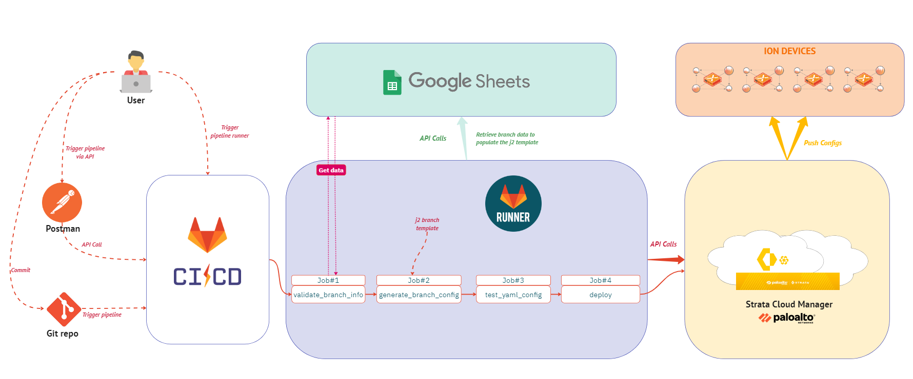

# PrismaSASE-ConfigAutomation with GitLab CI/CD

## Overview

The Prisma SASE ConfigAutomation is a tool designed to streamline the management of Prisma SASE Cloud Controller (Strata Cloud Manager) configurations. It enables the export and import of configurations and templates, supporting continuous integration workflows for seamless updates and deployment of configurations.



## Features

- Export and import configurations from the Prisma SASE Cloud Controller.
- Replace ION devices at sites by updating the configuration with a new serial number.
- Maintain configuration state through version control systems and CI pipelines.
- Roll back configurations to previous states if needed.
- Delete configurations by removing them from the file or setting them to null.
- Deploy configurations as templates to multiple sites efficiently.

## Requirements

- An active Prisma SASE account.
- Python version 2.7 or higher (up to 3.6 or higher).
- Prisma SASE Python SDK version 5.6.1b2 or higher.

## Setup

### Via pip:

1. Clone this repository to your local machine:

```bash
$ git clone https://github.com/baadrdeen/prisma_sase_config.git
```

2. Navigate to the project directory:

```bash
$ cd prisma_sase_config
```

3. Install the required Python packages:

```bash
$ pip install -r requirements.txt
```

4. After install, pull_site/do_site scripts should be placed in the Python Scripts directory.

## Usage

1. Use the Strata Cloud Manager  to configure a branch and related settings. Note the branch name.
2. Extract the configuration with `pull_site`:
   ```bash
   $ python pull_site -S "MySiteName" --output MySiteName.yaml
   ```
3. Edit the configuration file as needed.
4. Apply the configuration with `do_site.py`:
   ```bash
   $ python do_site.py UK_RemoteBranch_settings.yml

         No Change for Site UK_RemoteBranch.
      No Change for Waninterface UK_RemoteBranch-WAN_Link_1.
      No Change for Waninterface UK_RemoteBranch-WAN_Link_2.
      No Change for Spoke Cluster UK_RemoteBranch.
      No Change for Site NAT Localprefix mapping for Localprefix Vm Client .
      Updated Device ID Config 1712691016045 (Etag 2 -> 2).
      Element: Code is at correct version 5.6.13-b3.
      No Change for Element UK_RemoteBranch-1.
      WARNING: Cannot use configuration for interface 3, it is set as a parent for 3.20.
         No Change for Interface 3.1.
         No Change for Interface 3.10.
         No Change for Interface 3.2.
         No Change for Interface 3.20.
         No Change for Interface 1.
         No Change for Interface 2.
         No Change for Interface controller 1.
      WARNING: Cannot use configuration for interface 3, it is set as a parent for 3.20.
         No Change for Interface 4.
         No Change for Interface 5.
         No Change for Interface 6.
         No Change for Interface 7.
         No Change for Interface 8.
         No Change for Interface 9.
         No Change for Spoke HA in Element UK_RemoteBranch-1.
         No Change for BGP Global Config 1712576424183025045.
         No Change for Staticroute LAN_Subnet 1.
         No Change for Staticroute LAN_Subnet 2.
         No Change for NTP 1712051337068007745.
         No Change for Toolkit 1712051344428012945.
         No Change for Application Probe default-probe-configuration-16626015845.
      Element: Code is at correct version 5.6.13-b3.
      No Change for Element UK_RemoteBranch-2.
      WARNING: Cannot use configuration for interface 3, it is set as a parent for 3.20.
         No Change for Interface 3.1.
         No Change for Interface 3.10.
         No Change for Interface 3.2.
         No Change for Interface 3.20.
         No Change for Interface 1.
         No Change for Interface 2.
         No Change for Interface controller 1.
      WARNING: Cannot use configuration for interface 3, it is set as a parent for 3.20.
         No Change for Interface 4.
         No Change for Interface 5.
         No Change for Interface 6.
         No Change for Interface 7.
         No Change for Interface 8.
         No Change for Interface 9.
         No Change for Spoke HA in Element UK_RemoteBranch-2.
         No Change for BGP Global Config 1712576685103013245.
         No Change for Staticroute LAN_Subnet 1.
         No Change for Staticroute LAN_Subnet 2.
         No Change for NTP 17009000545.
         No Change for Toolkit 171204945.
         No Change for Application Probe default-probe-configuration-56545514008545.
      No Change for Site UK_RemoteBranch state (active).
      DONE
      ```

## Caveats and Known Issues

- This is a preview release; issues may arise.
- Requires a specific version of the Prisma SASE SDK.
- It is recommended to manage one site per configuration file.
- Site renaming is not supported; changing the site name creates a new site.
- Deletion of sites is irreversible and should be done with caution.
- Certain operations have safety factors and may require additional steps.

# Gitlab CI/CD Pipeline

## Purpose of the Pipeline

The CI/CD pipeline is designed to automate the process of generating, testing, and deploying site templates for Prisma SASE environments. It ensures systematic application and verification of configuration changes.

## Prerequisites

- A GitLab account with appropriate permissions.
- A GitLab Runner registered to your project.
- A Python environment with the correct version installed.
- Prisma SASE credentials with the necessary roles for SD-WAN management.
- A GCP service account with read-only access to the required Google Sheets file and the associated JSON key file.

## Importing the GitHub Repository to GitLab CI/CD

In order to use this pipeline you must first import the repository into your GitLab environment. Please follow these steps to do so:

1. **Create a New Project in GitLab**:
   - Sign in to your GitLab account.
   - Navigate to your dashboard and click on "New project".
   - Choose "Import project" then select "Repo by URL".

2. **Provide the Repository URL**:
   - In the "Git repository URL" field, enter the following URL:
     ```
     https://github.com/baadrdeen/prisma_sase_config
     ```
   - Provide any additional details required by GitLab, such as the project name and visibility settings.

3. **Start the Import**:
   - Click on "Create project" to begin the import process.
   - GitLab will clone the repository from the provided URL.

4. **Verify the Import**:
   - After the import is complete, you will be taken to the project page in GitLab.
   - Check to ensure that the repository, including all branches and commit history, has been imported successfully.

5. **Update Local Repository (if applicable)**:
   - If you have a local clone of the repository and wish to push to GitLab, update the remote URL:
     ```bash
     git remote set-url origin <new-gitlab-repository-url>
     ```
   - Replace `<new-gitlab-repository-url>` with the actual URL of your new GitLab repository.

6. **Set Environment Variables**:
- Set up a new CI/CD environment named `production`.
- Create protected environment variables linked to the `production` environment for Strata Cloud Manager authentication: `CLIENT_ID`, `CLIENT_SECRET`, `TSG_ID`, and `SITE_ID`.
- Assign values to `CLIENT_ID`, `CLIENT_SECRET`, and `TSG_ID` using a service account to enable authentication with the Strata Cloud Manager API.

For detailed instructions, refer to the GitLab documentation on [importing projects from other URLs](https://docs.gitlab.com/ee/user/project/import/repo_by_url.html).


## Pipeline Setup Procedure

Before running the pipeline, you need to create a Jinja2 template for your branches and update the `Branch_Config_Maker.py` and `Validate_branch_info.py` scripts with the specific mapping information based on the structure of the spreadsheet on Google Sheets.

### Step 1: Create a Jinja2 Template

To create a Jinja2 template for your branches, follow these steps:

1. **Execute the Pull Site Script**: Run the `pull_site` script on a branch that has already been created and configured, including the ION configurations. This will generate a YAML file with the current configuration of the site.

   ```bash
   $ python pull_site -S "ExistingBranchName" --output ExistingBranchConfig.yaml
   ```

2. **Create the Jinja2 Template**: Use the generated YAML file as a starting point to create your Jinja2 template. Replace specific values with placeholders (e.g., `{{variable}}`) to make the template dynamic.

   For example, if you have a section for static routing that varies based on the number of static routes, you can create a loop in the Jinja2 template to iterate over each route:

   ```jinja2
   static v2.3:
       
       {{ route.name }}:
         address_family: ipv4
         description:
         destination_prefix: {{ route.destination_prefix }}
         network_context_id:
         nexthop_reachability_probe: false
         nexthops:
         - admin_distance: 1
           nexthop_interface_id:
           nexthop_ip: {{ route.nexthop_ip }}
           self: true
         scope: global
         tags:
         vrf_context_id: Global
       
   ```

3. **Customize the Template**: Continue to modify the rest of the template, adding variables and loops as needed to accommodate the dynamic aspects of your configuration.

4. **Save the Template**: Once you have replaced all the necessary values with Jinja2 placeholders, save the file as `template.jinja2` with a `.jinja2` extension.

By following these steps, you will have a Jinja2 template that can be used to generate YAML configuration files for different branches with varying site information.

### Step 2: Update `Validate_branch_info.py`

Complete the `validate_site_info` function to include all necessary validation checks for the site information fields.

The current `Validate_branch_info.py` script will be updated to incorporate validation checks for the site information fields. Below is an example demonstrating how you can customize it:

1. **Update `fields_to_check`**: Define a list of keys that should not be empty in the site information. These fields are essential for the configuration and must be present.

   ```python
   fields_to_check = [
       "Site_ID",
       "Device_Name",
       "Location",
       # Add other required fields here
   ]
   ```

2. **Update `ip_fields`**: Define a list of keys that should contain valid IP addresses. These fields will be checked to ensure they have the correct IP format.

   ```python
   ip_fields = [
       "Management_IP",
       "LAN_Interface_IP",
       # Add other IP-related fields here
   ]
   ```

3. **Modify the Validation Functions**: Use the `is_valid_ip` function to validate IP fields and ensure that the `validate_site_info` function checks both the presence of required fields and the validity of IP addresses.

   ```python
   def validate_site_info(site_info):
       """Validate site information."""
       for field in fields_to_check:
           if not site_info.get(field):
               print(f"Field '{field}' is empty.")
               return False
       
       for field in ip_fields:
           ip_value = rm_spaces(site_info[field])
           if not is_valid_ip(ip_value):
               print(f"Invalid IP address format for field '{field}': '{site_info[field]}'")
               return False
       
       return True
   ```

4. **Complete the Script**: Ensure that all other necessary validation functions are included in the script, such as `is_valid_subnet` for validating subnets in CIDR notation, and `is_valid_ip_list` for validating lists of IP addresses.

5. **Test the Validation**: Run the script with a test `site_id` to ensure that the validation checks are functioning correctly and that the site information is being validated as expected.

By updating the `Validate_branch_info.py` script with these validation checks, you will ensure that the site information retrieved from Google Sheets is complete and correctly formatted before it is used to generate the YAML configuration file.

### Step 3: Update `Branch_Config_Maker.py`

To update the `Branch_Config_Maker.py` script with the data mapping for your Jinja2 template, follow these steps:

1. **Define the Data Mapping**: Inside the `populate_yaml_data` function, create a dictionary that maps the variables in your Jinja2 template to the corresponding values from the `site_info` JSON object. This dictionary will be used to render the template.

   ```python
   def populate_yaml_data(site_info):
       """Populate data for rendering YAML template."""
       data = {
           "site_id": site_info["Site_ID"],
           "Region": site_info["Region"],
           "street": site_info["Address"],
           # Add additional mappings here
       }
       return data
   ```

2. **Test the Script**: After updating the script, run it with a test `site_id` to ensure that the YAML configuration file is generated correctly with the mapped data.

By completing the data mapping in the `Branch_Config_Maker.py` script, you will enable the dynamic generation of YAML configuration files based on the site information provided in the JSON file. This allows for the creation of site-specific configurations using the Jinja2 template.

## Run the Pipeline

After setting up the Jinja2 template and updating the scripts with the correct mappings and validations, you can run the pipeline using one of the following methods:

#### Method 1: Run Pipeline from the Pipeline Runner

To run the pipeline using a pipeline runner:

1. **Set Up a Runner**: Ensure you have a GitLab runner set up and registered to your project. The runner will execute the jobs defined in the `.gitlab-ci.yml` file.

2. **Trigger the Pipeline**: You can trigger the pipeline manually from the GitLab UI by navigating to your project's **Build > Pipelines** section and select the branch you want to run the pipeline on, and then click "Run pipeline". You'll receive a prompt to enter the site ID.

3. **Approve deployment**: You will need to approve the deployment if the previous stages have been validated using the GUI.

### Method 2: Trigger Pipeline Using Postman and GitLab API

To trigger the pipeline using Postman and the GitLab API, follow these steps:

1. Open Postman and create a new POST request.
2. Set the URL to the GitLab API pipeline trigger endpoint:
   ```
   https://gitlab.com/api/v4/projects/<project-id>/trigger/pipeline
   ```
3. In the Headers section, add your `PRIVATE-TOKEN` with the value of your GitLab API access token.
4. In the Body section, set the request type to form-data and add the following keys and values:
   - `token`: The token for the specific trigger you want to use. This should be placed in the body data of the request as form-data.
   - `ref`: The name of the branch you want to run the pipeline on. This also goes in the body data as form-data.
   - `variables[SITE_ID]`: Specify the site ID or branch that will be deployed. This key-value pair should be included in the body data as form-data.
5. Send the request to trigger the pipeline.

Here's an example of how the body data should be configured in Postman:

- Key: `token` | Value: `<your-trigger-token>`
- Key: `ref` | Value: `<your-branch-name>`
- Key: `variables[SITE_ID]` | Value: `<your-site-id>`

Remember to replace `<project-id>`, `<your-trigger-token>`, `<your-branch-name>`, and `<your-site-id>` with your actual project details and desired values. This setup will trigger the CI/CD pipeline for the specified branch and pass the `SITE_ID` as a variable to the pipeline, which can be used for deployment.

## References

For additional information and further reading, refer to the following resources:

- [Google API Reference](https://developers.google.com/api-client-library)
  - Detailed information on Google API libraries and programmatic interaction with Google services.

- [Prisma SASE SDK Reference](https://pan.dev/sase/docs/)
  - Comprehensive guides and API references for integrating with the Prisma SASE platform.

- [GitLab CI/CD Documentation](https://docs.gitlab.com/ee/ci/)
  - Official documentation for GitLab's continuous integration and deployment features, providing guidance on how to set up and configure CI/CD pipelines.

Ensure to review these resources to effectively utilize the APIs, SDKs, and CI/CD practices in your project.


## Disclaimer

- This script comes with no warranty or support. Use it at your own risk.
- Verify your configuration thoroughly, and it's recommended to execute the pipeline in a staging environment before deploying to production.
- Review the pipeline and understand the implications before making changes to your Strata Cloud Manager.

## Author

[Badr-eddine](https://www.linkedin.com/in/badreddine-aharchi)

## Contributing

Contributions are welcome! If you encounter any issues or have suggestions for improvements, please create an issue or submit a pull request.

## License

This project is licensed under the [MIT License](https://github.com/baadrdeen/prisma_sase_config/blob/main/LICENSE).
